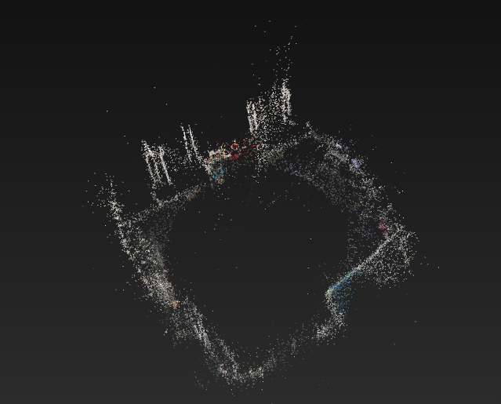
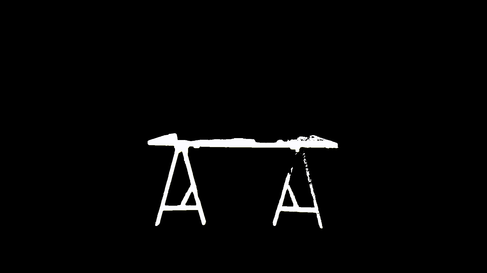
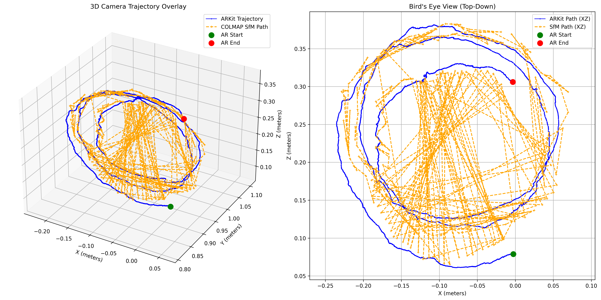
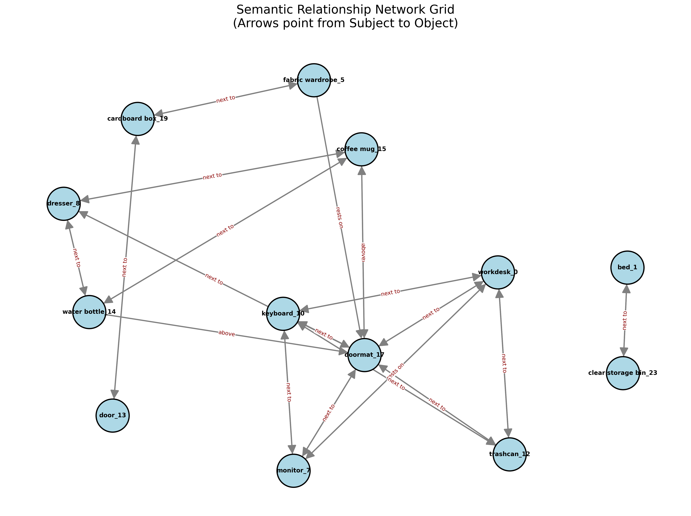
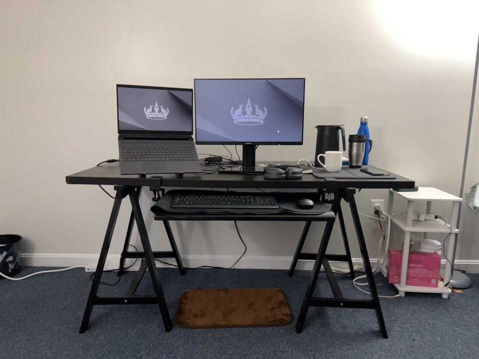

# 3D Semantic Scene Reconstruction & Querying Pipeline

An end-to-end computer vision pipeline that converts raw RGB video and ARKit tracking data into a mathematically precise, queryable 3D semantic scene graph.

|                COLMAP Sparse Point Cloud                 |                           SuGaR 3D Splatting                           |
| :------------------------------------------------------: | :--------------------------------------------------------------------: |
|  |  |

|                    YOLO + SAM2 Tracking                     |                       3D Semantic Segmentation                       |
| :---------------------------------------------------------: | :------------------------------------------------------------------: |
|  |  |

|                  ARKit Trajectory Alignment                   |                       Semantic Scene Graph                        |
| :-----------------------------------------------------------: | :---------------------------------------------------------------: |
|  |  |

---

## Pipeline Architecture

Video captured using iPhone 14 Pro in CamTrackAR app and frames extracted at 5 FPS. 


This project is divided into two primary phases that can be executed via Docker.


### Phase 1: 3D Reconstruction (`make reconstruction`)

1. **Pose Estimation**: Uses COLMAP to extract frames, compute features, and estimate initial camera poses.
2. **Metric Alignment**: Aligns the arbitrary COLMAP positional scale to true physical metric scale using iOS ARKit trajectory data (`src/utils/align_trajectory.py`).
3. **Point Cloud Generation**: Runs SuGaR (Surface-Aligned Gaussian Splatting) on the aligned poses to create a high-fidelity continuous 3D representations of the room.

---

### Phase 2: Semantic Segmentation & Scene Graph (`make segmentation`)

1. **Semantic Grounding**: Uses YOLO World (`src/segmentation.py`) to detect open-vocabulary objects defined in your config.
2. **Temporal Tracking**: Uses SAM 2 to track the object masks consistently across the video sequence.
3. **3D Lifting & Semantic Loop Closure**: Projects the tracked 2D masks into the 3D Gaussian splat space. It employs mathematical Semantic Loop Closure to automatically fuse physically adjacent point clouds of the same class (e.g., fractured tracking of different sides of a bed).
4. **Scene Graph Generation**: Extracts physically accurate 3D Oriented Bounding Boxes (OBBs) using Principal Component Analysis on the floor (XZ) plane. Computes spatial relationships (distances, `resting_on`, `across_room`, axial directions) and exports the topology to `scene_graph.json`.
5. **Visualization**: Automatically generates semantic network relationship node-graphs (`src/utils/visualize_network_graph.py`).

---

## Querying the Scene

The system includes a local LLM interface (`src/utils/query_scene.py`) running via Ollama. By injecting the `scene_graph.json` as grounded physical context, the LLM can answer questions using explicit physical spatial reasoning.

**Example Usage:**
```bash
python3 src/utils/query_scene.py "What objects are resting on the workdesk?"
python3 src/utils/query_scene.py "What is the relationship between the door and the bed?"
```

## Setup & Execution
- Configure target objects and paths in `configs/pipeline_config.json`.
- The pipeline utilizes `docker compose` for complete environment isolation (COLMAP, PyTorch, SAM2).
- **Commands:**
  - `make build-all`: Build all Docker containers.
  - `make reconstruction`: Run Phase 1 (Splats & Alignment).
  - `make segmentation`: Run Phase 2 (Tracking, Scene Graph & Queries).
